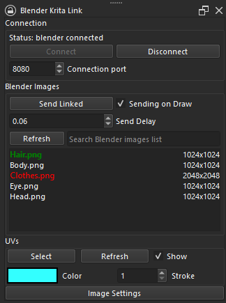

# Blender Krita Link Plugin

This plugin offers a seamless way to edit Blender images in Krita without the need for file reloads.

[Krita Artists post](https://krita-artists.org/t/blender-krita-link-plugin-for-texture-editing-in-krita/83980)

## Features

- Links Blender textures with Krita files.
- Imports Blender textures as new layers.
- Selects UV faces in Blender (they must be selected in both edit mode and UV editor; this feature requires the C++ plugin).
- Transfers UV maps from selected objects in Blender to Krita.
- Offers Shortcuts for sending image, toggling uvs and getting uvs.



https://github.com/heisenshark/blender-krita-link-plugin/assets/46131664/45f3323f-0e44-4db7-af15-114b76320710

## Installation

The plugin consists of two parts: one for Blender and one for Krita.

[download](https://github.com/heisenshark/blender-krita-link-plugin/archive/refs/heads/master.zip) the repo

### Blender Part

- Place the `BlenderKritaLink` folder in the `blender/version/scripts/addons/` directory.

### Krita Part

- Place `KritaBlenderLink` and `KritaBlenderDesktop.html` in the `<kritainstallation>/pykrita/` folder.

### UVselectAddition Installation

- download uv selection addition for your system \[windows / linux\] from [releases](https://github.com/heisenshark/blender-krita-link-plugin/releases) page
- unpack it in your krita program directory

#### manual compilation

- Compile Krita from source using [compile the krita](https://docs.krita.org/en/untranslatable_pages/building_krita.html) or [compile the krita using docker](https://docs.krita.org/en/untranslatable_pages/building/build_krita_with_docker_on_linux.html) if you encounter issues.
- Place `uv-select` from `cppPart` in the `krita>plugins` directory.
- Compile again and create an AppImage as in tutorials if you are using Linux.
- Extract libraries and action files to your Krita installation as described in this [repository](https://github.com/Acly/krita-ai-tools).

#### nixos installation

- Change the krita project with the files provided in cppPart(also add `add_subdirectory( uv-select )` to plugins/CmakeLists.txt).
- Create the patch using `git diff > uv-select.patch`(the path might be in the downloads also).
- Modify krita package in your system.

```nix
# using flakes
  let
  ...
  kritaWithPlugin = pkgs.krita.override {
    unwrapped = pkgs.krita.unwrapped.overrideAttrs (old: {
      patches =
        old.patches
        or []
        ++ [
          ./patches/uv-select.patch
        ];
    });
  };
  in ...
```

- Put the package in your system config.

Also you could probably use the postInstall to extract the files into krita installation or some other way to not use the patches like extracting cpp files from this repo before the compilation by some script(If you found a method like that feel free to submit pr).

UVSelectionAddition is not required for the Python plugin to work but offers additional features.

## Usage

### Enabling the Plugin

- In Krita: Activate the plugin via `Settings > Configure Krita > Python Plugin Manager`. Restart Krita and enable the dock under `Settings > Docker > Blender Krita Link`.
- In Blender: Enable the plugin through `Edit > Preferences > Add-ons > Blender Krita Link`.

### Plugin Operations

- Use the `Connect` button to link to Blender, after that you can use `Disconnect` button to end your session. Also you can change `Connection port` both in Krita and Blender.
- The plugin loads images from Blender into a list. Link an image by right-clicking it and selecting `Link image`, or import a texture by clicking `From Blender to new layer`. you open an image in new document(and link) too. Also you can use double click to make action based on context.
- To enable linking, ensure the Krita document is the same size as the Blender image. Set the correct color spectrum under `Image > Properties > Image Color Space` (RGB/Alpha and Profile: sRGB options are recommended).
- If "Send on draw" is activated, the image will update in Blender when you release the draw button on the canvas (and use ctrl+(Shift)+Z). You can also send data manually using the "Send Data" button.
- Use `Refresh` to update image list from blender and query it by `Search Blender images list` textbox.
- Use `Refresh` in uvs section to get the UV map from selected object(in blender) to krita.
  - you can also change color and the stroke weight of uv maps and their visibility
- Use `Select` in uvs section for converting selected uvs in Blender to Krita selection
- you can also enable the auto update of uvs and images list in blender using `sync uvs and images` checkbox, with the sync interval variable.

### Disclaimers

This plugin is highly experimental and may contain bugs. If you wish to contribute or help improve it, feel free to contact me, make pull requests, or suggest improvements.
This plugin probably does not work well on macos.

### credits

- (magic-uv)[https://github.com/nutti/Magic-UV] for some code to export uv islands
- (some random code from krita artists)[https://krita-artists.org/t/canvas-render-how-to/31540] by user AkiR
- Pribambase for showing how to do good blender integration plugin
- krita and blender for nice foss
